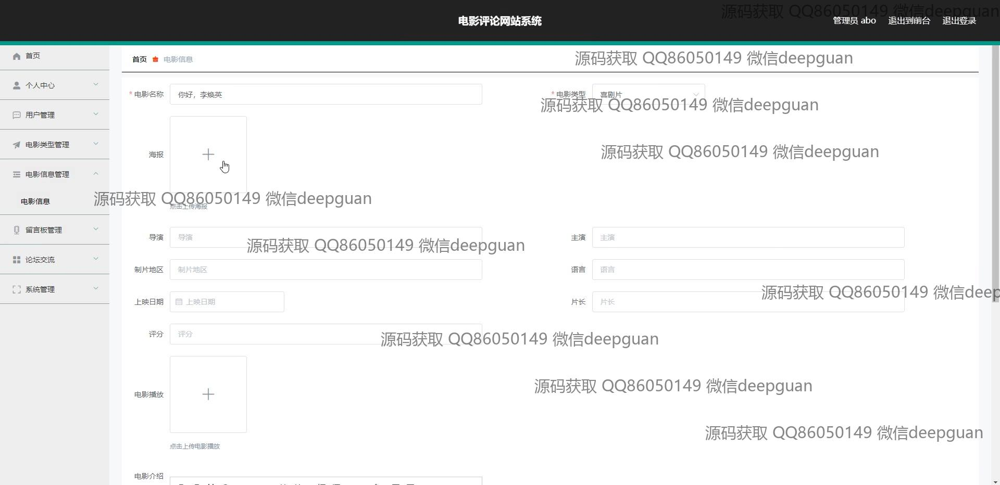
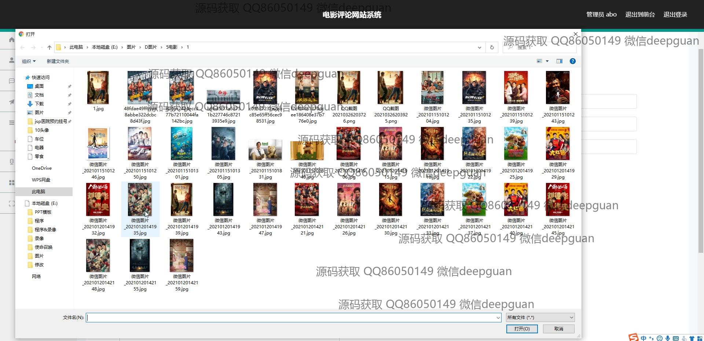
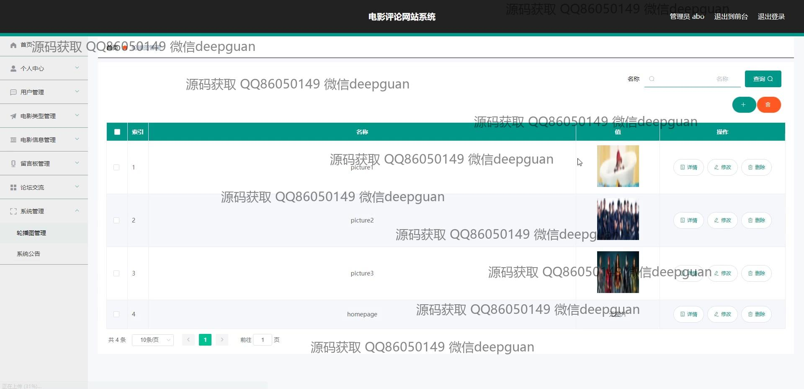
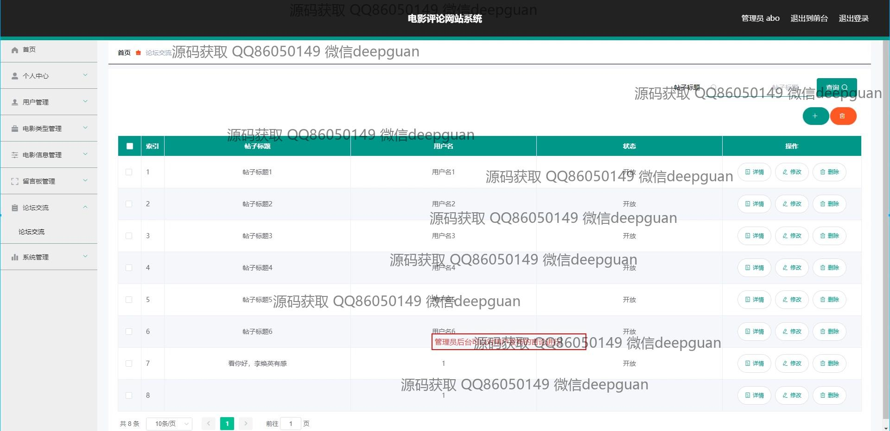

<h1 align="center">电影评论网站系统设计与实现</h1>

## 简介
电影评论网站系统：角色分为管理员、用户；涵盖用户管理、电影信息管理、论坛交流、轮播图及留言管理功能，提供简洁的界面设计与丰富互动功能，实现多样化的电影评价体验。    --计算机毕业设计源码；毕设源码；java毕业设计源码

## 联系方式

<h3 align="center">获取完整代码与数据库文件 + 微信：deepguan QQ: 86050149 QQ群: 783742310</h3>

<h3 align="center">可帮忙远程部署 包运行成功！提供远程部署、修改代码、设计文档指导、代码讲解等服务！</h3>

## 功能介绍（完整见运行截图）
管理员： 基本功能包括登录、注册和退出。在网站后台管理中，管理员可以操作用户管理、电影信息管理、电影类型管理、论坛交流和系统公告管理等功能。主页显示的模块有用户管理、评论管理、轮播图管理以及系统维护。管理员可以进行电影信息的录入和编辑，包括上传海报、填写电影相关信息等。此外，论坛和留言板的帖子和评论也由管理员审核和管理，确保平台的和谐与有序。

用户： 在此电影评论网站中，用户需先注册并登录才可进行各种交互操作。主要功能包括浏览电影信息、参与论坛讨论和查看、发布评论等。用户可以在个人中心查看和修改个人信息，管理自己的收藏与留言。导航栏提供了多个访问入口，如首页、电影详情、论坛交流和留言反馈等。用户评论区域支持使用富文本编辑器进行格式化编辑，提升用户的互动体验。

## 运行截图

本代码来源于网络,仅供学习参考使用!

